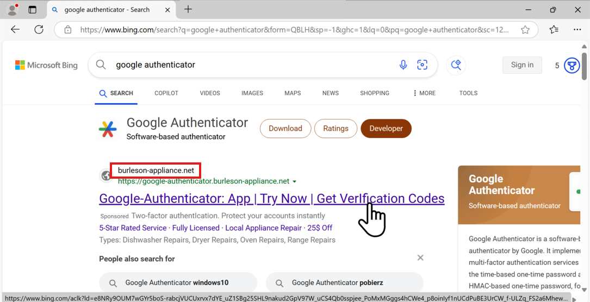

## 🕵️‍♂️ MTA-2025-01-22

🔍[Source](https://www.malware-traffic-analysis.net/2025/01/22/index.html) 


---

### 📌 Contexte

- Un utilisateur télécharge un faux logiciel (Google Authenticator) depuis un site frauduleux, entraînant l’infection de son poste Windows et la communication avec plusieurs serveurs C2. 
- Ce document contient une **analyse pas-à-pas avec captures d’écran** pour chaque question.
  


---

### 🧰 Outils utilisés

- [Wireshark](https://www.wireshark.org/download.html)
- [Kali Linux](https://www.kali.org/)
- [VMware](https://www.vmware.com/products/desktop-hypervisor/workstation-and-fusion)
- [VirusTotal](https://www.virustotal.com/gui/home/upload)
- [MITRE ATT&CK](https://attack.mitre.org/)

---

### 📝 Questions & Analyse

#### Q1. What is the IP address of the infected Windows client?
<details>
    <summary>💡 Étapes</summary>

  - Étape 1 : Ouvrir le PCAP (via terminal ou fichier directement)

  - Étape 2 : Filtrer le fichier avec le Basic filter pour trouver la première requête HTTP suspecte

        (http.request or tls.handshake.type == 1) and !(ssdp)
</details>


<details>
  <summary>✅ Réponse</summary>
  
`10.1.17.215`
</details>

<details>
  <summary>📷 Captures</summary>

</details>


---

#### Q2. What is the mac address of the infected Windows client?
<details>
    <summary>💡 Étapes</summary>

  - Étape 1 : Filtrer le fichier avec le Basic filter pour trouver la première requête HTTP suspecte

        (http.request or tls.handshake.type == 1) and !(ssdp)
</details>


<details>
  <summary>✅ Réponse</summary>
  
`00:d0:b7:26:4a:74`
</details>

<details>
  <summary>📷 Captures</summary>

</details>


---

#### Q3. What is the host name of the infected Windows client?
<details>
    <summary>💡 Étapes</summary>

  - Étape 1 : Dans certains PCAPs, tu peux retrouver le nom d’hôte Windows de la victime grâce au trafic **NBNS ou SMB/SMB2**. Utiliser le filtre approprié.

        nbns or smb or smb2
</details>


<details>
  <summary>✅ Réponse</summary>
  
`DESKTOP-L8C5GSJ`
</details>

<details>
  <summary>📷 Captures</summary>

</details>


---

#### Q4. What is the user account name from the infected Windows client?
<details>
    <summary>💡 Étapes</summary>

  - Étape 1 : Filtrer les paquets Kerberos provenant de la machine infectée.
  
          ip.src == 10.1.17.215 and kerberos.CNameString
    
  - Étape 2 : Inspecter le champ `CNameString` dans le panneau *Packet Details* pour relever le nom d’utilisateur.
</details>


<details>
  <summary>✅ Réponse</summary>
  
`shutchenson`
</details>

<details>
  <summary>📷 Captures</summary>

</details>


---

#### Q5. What is the likely domain name for the fake Google Authenticator page?
<details>
    <summary>💡 Étapes</summary>
    
- Étape 1 : Appliquer un filtre pour isoler les requêtes DNS émises par l’hôte 10.1.17.215.
  
      ip.src == 10.1.17.215 && (dns && dns.flags.response == 0) && dns.qry.name matches "(auth|google|authenticator)"
  
      ⚠️ dns.flags.response == 0 pour ne filtrer que les DNS queries initiées par le client.
- Étape 2 : Repérer le ou les domaines suspects qui imitent Google Authenticator.

      ⚠️ Un domaine avec une faute de frappe évidente (ex. double "o") est généralement un signe de domaine malicieux.

- Étape 3 : Vérifier les réponses DNS pour obtenir les adresses IPv4 résolues par ces domaines.
    
        (dns.qry.name == google-authenticator.burleson-appliance.net || dns.qry.name == authenticatoor.org) && dns.flags.response == 1 && dns.qry.type == 1

      ⚠️ dns.flags.response == 1 capture uniquement les réponses (!= client).
      ⚠️ dns.qry.type == 1 limite aux enregistrements A (== IPv4).
  
- Étape 4 : Vérifier la réputation des domaines/IP suspects via [VirusTotal](https://www.virustotal.com/gui/home/upload).


</details>  

<details>
  <summary>✅ Réponse</summary>
  
`google-authenticator.burleson-appliance.net`

`authenticatoor.org`
</details>

<details>
  <summary>📷 Captures</summary>


</details>


<details>
  <summary>🔗 Liens VirusTotal</summary>
    
[google-authenticator.burleson-appliance[.]net](https://www.virustotal.com/gui/domain/google-authenticator.burleson-appliance.net)

[authenticatoor[.]org](https://www.virustotal.com/gui/domain/authenticatoor.org)

[104.21.64[.]1](https://www.virustotal.com/gui/ip-address/104.21.64.1)

[82.221.136[.]26](https://www.virustotal.com/gui/ip-address/82.221.136.26)

</details>


---


#### Q6. What are the IP addresses used for C2 servers for this infection?
<details>
    <summary>💡 Étapes</summary>

  - Étape 1 : Appliquer un filtre pour identifier tous les adresses IP sortants de l’hôte infecté.

        ip.src == 10.1.17.215 && (http.request or tls.handshake == 1 or (tcp.flags.syn == 1 && tcp.flags.ack == 0)) && !(ssdp) && ip.dst != 10.1.17.0/24
        
  - Étape 2 : Filtrer les adresses IP internes/légitimes
    
          ⚠️ Trafic vers réseau interne (10.1.17.0/24)
          ⚠️ Services connus comme Microsoft, Google, Edge, etc.

  - Étape 3 : Vérifier la réputation des adresses IP suspects via [VirusTotal](https://www.virustotal.com/gui/home/upload).
</details>


<details>
  <summary>✅ Réponse</summary>
  
`5.252.153[.]241`

`45.125.66[.]32`

`45.125.66[.]252`

</details>

<details>
  <summary>📷 Captures</summary>


</details>

<details>
  <summary>🔗 Liens VirusTotal</summary>

[5.252.153[.]241](https://www.virustotal.com/gui/ip-address/5.252.153.241)

[45.125.66[.]32](https://www.virustotal.com/gui/ip-address/45.125.66.32)

[45.125.66[.]252](https://www.virustotal.com/gui/ip-address/45.125.66.252)

</details>


---

### 🕵️‍♂️ Rapport d'incident
<details>

    
#### 📌 Résumé

Le 2025-01-22 à 15:03 UTC, un poste Windows utilisé par l’utilisateur `shutchenson` a été compromis suite au téléchargement d’un logiciel frauduleux depuis un site imitant Google Authenticator (`authenticatoor[.]org`).

Le malware a installé plusieurs fichiers malveillants, mis en place un mécanisme de persistance au démarrage, et établi une communication avec plusieurs serveurs de command-and-control (C2) pour assurer un contrôle continu de la machine compromise.

---

#### 🖥️ Détails de la victime

- Nom d'utilisateur : `shutchenson`
- Nom d'hôte : `DESKTOP-L8C5GSJ`
- IP locale : `10.1.17[.]215`
- Adresse MAC : `00:d0:b7:26:4a:74`

---
#### 🚨 Indicateurs de compromission (IoCs)

Domaines/URLs suspects :
- `google-authenticator.burleson-appliance[.]net`
- `authenticatoor[.]org` 

Serveurs C2 :
- `5.252.153[.]241`
- `45.125.66[.]32`
- `45.125.66[.]252`

Ports :
- `TCP/80 (HTTP)`
- `TCP/443 (HTTPS)`

Fichiers suspects :
- `TeamViewer[.]exe` 
- `TV[.]dll` 
- `pas[.]ps1`
- `skqllz[.]ps1`

Persistance :
- Raccourci dans le dossier Startup `%APPDATA%\Microsoft\Windows\Start Menu\Programs\Startup\TeamViewer.ln`

---

#### 🔍 Analyse Détaillée
<details>
    
1️⃣ Extraction et exécution de scripts

- Le client effectue une requête `GET /api/file/get-file/264872` et récupère un composant HTML contenant un **VBScript**.
- Le VBScript télécharge et exécute un script PowerShell depuis `http://5.252.153[.]241:80/api/file/get-file/29842.ps1`.
- L’exécution est masquée grâce à `-WindowStyle Hidden` et `start /min`.
- Ouverture d’un site légitime (https://azure.microsoft.com) pour distraire l’utilisateur.
- Gestion des erreurs avec `On Error Resume Next` afin d’assurer la continuité du script.

2️⃣ PowerShell initial (`29842.ps1`)

- Contient une chaîne Base64 dissimulée via `.replace()`.
- Décodage et exécution dynamique avec `Invoke-Expression`.
- Identification de l’hôte **via le numéro de série du disque C:**

```$fso = New-Object -Com "Scripting.FileSystemObject"
$SerialNumber = $fso.GetDrive("c:\").SerialNumber
$SerialNumber = [convert]::toint64($SerialNumber,16)
$serial = $SerialNumber
$ip = 'http://5.252.153.241/'
$url = $ip+$serial
```

- Boucle infinie de téléchargement et exécution de commandes depuis le serveur C2, avec l'ajout de pauses de 5 secondes pour limiter la détection.

3️⃣ Téléchargement de fichiers et persistance

- Création du dossier `C:\ProgramData\huo` et téléchargement de plusieurs fichiers :
- `TeamViewer.exe` → exécutable principal
- `Teamviewer_Resource_fr.dll` → bibliothèque de support
- `TV.dll` → bibliothèque additionnelle
- `pas.ps1` → script secondaire
- Création d’un raccourci dans le dossier Startup pour assurer la persistance (`.lnk`):

```
$shortcutPath = "$([Environment]::GetFolderPath('Startup'))\TeamViewer.lnk"
Create-Shortcut $startupFilePath $shortcutPath
```

4️⃣ PowerShell furtif (`skqllz.ps1`)

- Script dissimulé avec des variables aléatoires, concaténations et remplacement de caractères.
- Décodage Base64 pour générer le script principal.
- Exécution en arrière-plan via `Start-Process`.
- Envoi régulier de logs au serveur C2 avec la fonction `Send-Log`.

5️⃣ Investigation des fichiers dans [VirusTotal](https://www.virustotal.com/gui/home/url)

- Le fichier `[.]` a été télécharger directement depuis le PCAP (`Files -> Export Objects -> HTTP`)
- SHA-256 : ``
- Type : 
- Community score :
- [Lien VirusTotal]

--

- Le fichier `[.]` a été télécharger directement depuis le PCAP (`Files -> Export Objects -> HTTP`)
- SHA-256 : ``
- Type : 
- Community score :
- [Lien VirusTotal]

--

- Le fichier `[.]` a été télécharger directement depuis le PCAP (`Files -> Export Objects -> HTTP`)
- SHA-256 : ``
- Type : 
- Community score :
- [Lien VirusTotal]

--

- Le fichier `pas[.]ps1` a été télécharger directement depuis le PCAP (`Files -> Export Objects -> HTTP`)
- SHA-256 : `a833f27c2bb4cad31344e70386c44b5c221f031d7cd2f2a6b8601919e790161e`
- Type : text type, ASCII text, with very long lines (1513 bytes), with CRLF line terminators
- Community score : flagged par 24 sur 60 == probablement malveillant
- [Lien VirusTotal](https://www.virustotal.com/gui/file/a833f27c2bb4cad31344e70386c44b5c221f031d7cd2f2a6b8601919e790161e/details)


</details>

---

#### 🕵️ MITRE ATT&CK Mapping
<details>
    
| Tactique                     | Technique (ID)                              | Description |
|-------------------------------|--------------------------------------------|------------------|
| Initial Access                | [Drive-by Compromise (T1189)](https://attack.mitre.org/techniques/T1189/)                | Téléchargement du logiciel frauduleux depuis un site imitant Google Authenticator |
| Execution                     | [PowerShell (T1059.001)](https://attack.mitre.org/techniques/T1059/001/)                     | Exécution de scripts PowerShell dissimulés |
| Persistence                   | [Startup Items (T1547.001)](https://attack.mitre.org/techniques/T1547/001/)                  | Raccourci dans le dossier Startup pour exécution automatique |
| Defense Evasion               | [Obfuscated Files or Information (T1027)](https://attack.mitre.org/techniques/T1027/)   | Scripts PowerShell et VBScript fortement dissimulés |
| Command and Control (C2)      | [Web Service (T1071.001)](https://attack.mitre.org/techniques/T1071/001/)                    | Communication avec serveur C2 via HTTP |
| Discovery                     | [System Information Discovery (T1082)](https://attack.mitre.org/techniques/T1082/)      | Récupération du numéro de série du disque pour identification unique |

</details>

---

#### 🛡️ Actions correctives recommandées

1. **Isolation** : déconnecter le poste pour stopper toute propagation.
2. **Blocage des IP malveillantes** : filtrer les adresses C2 sur le pare-feu et la passerelle.
3. **Analyse forensique** : identifier tous les fichiers et scripts malveillants sur le poste et le réseau.
4. **Audit des logs** : détecter toute activité suspecte supplémentaire.
5. **Renforcement des défenses** : mettre à jour antivirus, solutions EDR et restrictions PowerShell.
6. **Sensibilisation des utilisateurs** : rappeler les bonnes pratiques pour éviter les téléchargements depuis des sources non fiables.

---

#### 🔹 Conclusion

L’incident a été limité à un seul poste à ce stade, mais le potentiel de propagation et d’exfiltration de données reste élevé. La mise en œuvre rapide des actions correctives est cruciale pour sécuriser l’environnement et prévenir d’éventuelles attaques futures.
</details>

