## 🕵️‍♂️ MTA-2025-01-22

🔍[Source](https://www.malware-traffic-analysis.net/2025/01/22/index.html) 

---

### 📌 Contexte

- Un utilisateur télécharge un faux logiciel (Google Authenticator) depuis un site frauduleux, entraînant l’infection de son poste Windows et la communication avec plusieurs serveurs C2. 
- Ce document contient une **analyse pas-à-pas avec captures d’écran** pour chaque question.  

---

### 🧰 Outils utilisés

- [Wireshark](https://www.wireshark.org/download.html)
- [Kali Linux](https://www.kali.org/)
- [VMware](https://www.vmware.com/products/desktop-hypervisor/workstation-and-fusion)
- [VirusTotal](https://www.virustotal.com/gui/home/upload)

---

### 📝 Questions & Analyse

#### Q1. What is the IP address of the infected Windows client?

    
💡 Étapes

  - Étape 1 : Ouvrir le PCAP (via terminal ou fichier directement)

  - Étape 2 : Filtrer le fichier avec le Basic filter pour trouver la première requête HTTP suspecte

        (http.request or tls.handshake == 1) and !(ssdp)

  
✅ Réponse

  
`10.1.17.215`

  
📷 Captures

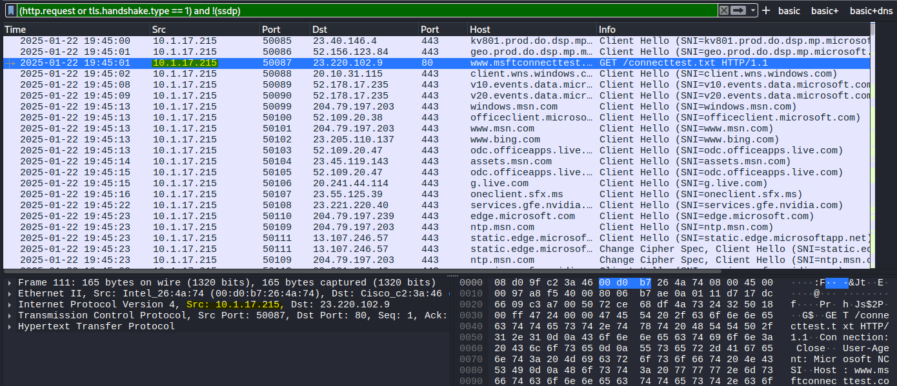

---

#### Q2. What is the mac address of the infected Windows client?

    
💡 Étapes

  - Étape 1 : Filtrer le fichier avec le Basic filter pour trouver la première requête HTTP suspecte

        (http.request or tls.handshake == 1) and !(ssdp)

  
✅ Réponse

  
`00:d0:b7:26:4a:74`

  
📷 Captures

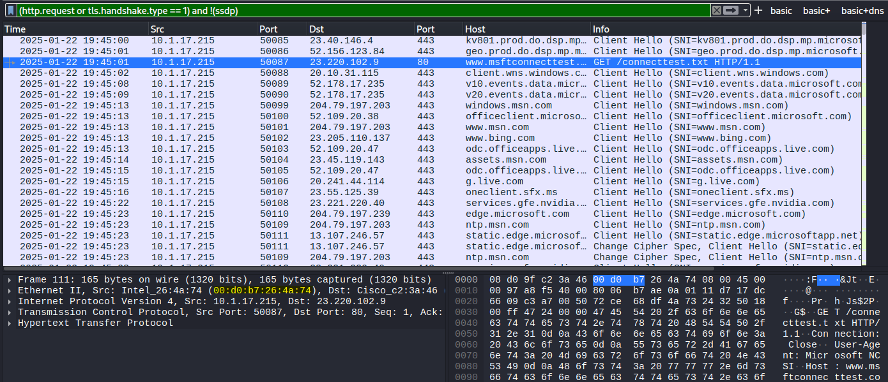

---

#### Q3. What is the host name of the infected Windows client?

    
💡 Étapes

  - Étape 1 : Dans certains PCAPs, tu peux retrouver le nom d’hôte Windows de la victime grâce au trafic **NBNS ou SMB/SMB2**. Utiliser le filtre approprié.

        nbns or smb or smb2

  
✅ Réponse

  
`DESKTOP-L8C5GSJ`

  
📷 Captures

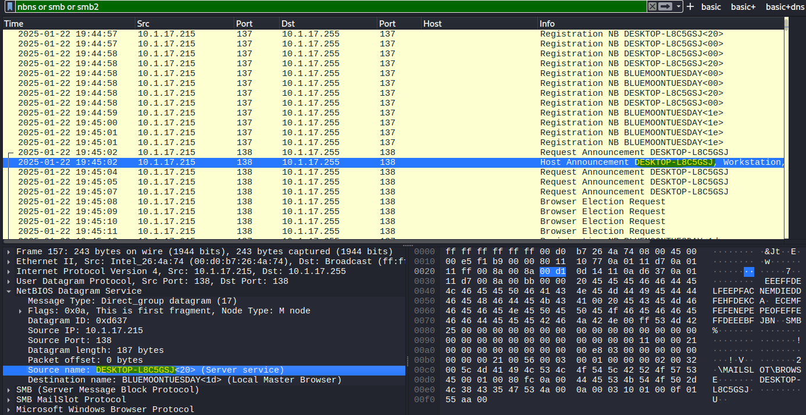

---

#### Q4. What is the user account name from the infected Windows client?

    
💡 Étapes

  - Étape 1 : Filtrer les paquets Kerberos provenant de la machine infectée.
  
          ip.src == 10.1.17.215 and kerberos.CNameString
    
  - Étape 2 : Inspecter le champ `CNameString` dans le panneau *Packet Details* pour relever le nom d’utilisateur.

  
✅ Réponse

  
`shutchenson`

  
📷 Captures

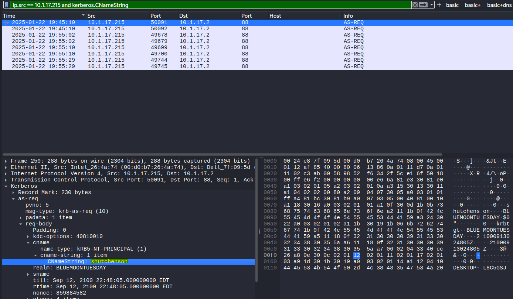

---

#### Q5. What is the likely domain name for the fake Google Authenticator page?

    
💡 Étapes

    
- Étape 1 : Appliquer un filtre pour isoler les requêtes DNS émises par l’hôte 10.1.17.215.
  
      ip.src == 10.1.17.215 && (dns && dns.flags.response == 0) && dns.qry.name matches "(auth|google|authenticator)"
  
      ⚠️ dns.flags.response == 0 pour ne filtrer que les DNS queries initiées par le client.
- Étape 2 : Repérer le ou les domaines suspects qui imitent Google Authenticator.

      ⚠️ Un domaine avec une faute de frappe évidente (ex. double "o") est généralement un signe de domaine malicieux.

- Étape 3 : Vérifier les réponses DNS pour obtenir les adresses IPv4 résolues par ces domaines.
    
        (dns.qry.name == google-authenticator.burleson-appliance.net || dns.qry.name == authenticatoor.org) && dns.flags.response == 1 && dns.qry.type == 1

      ⚠️ dns.flags.response == 1 capture uniquement les réponses (!= client).
      ⚠️ dns.qry.type == 1 limite aux enregistrements A (== IPv4).
  
- Étape 4 : Vérifier la réputation des domaines/IP suspects via [VirusTotal](https://www.virustotal.com/gui/home/upload).

  

  
✅ Réponse

  
`google-authenticator.burleson-appliance.net`

`authenticatoor.org`

  
📷 Captures

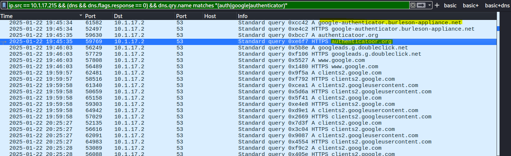
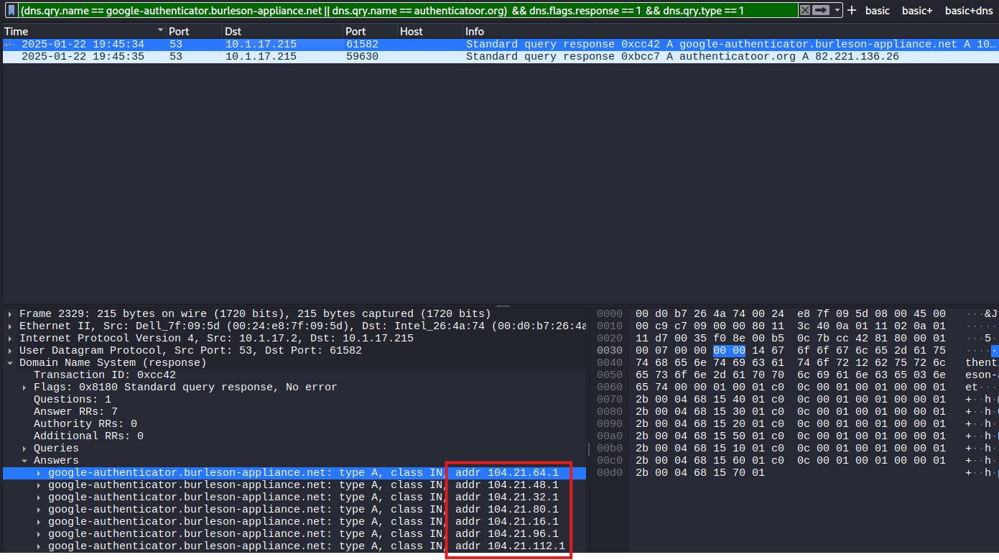

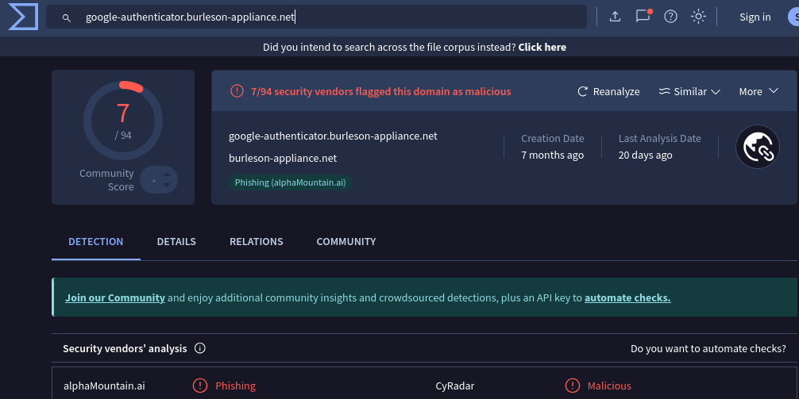
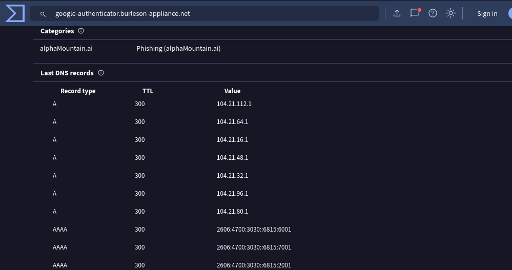
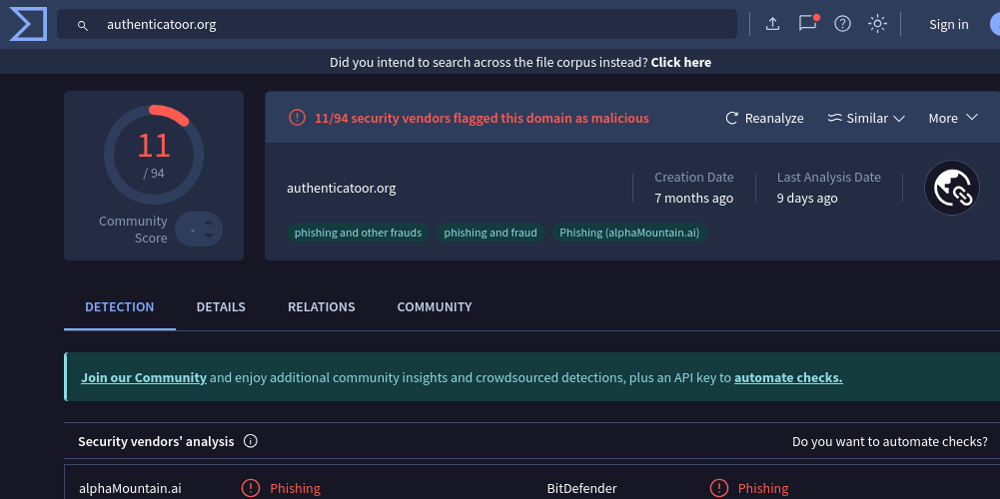
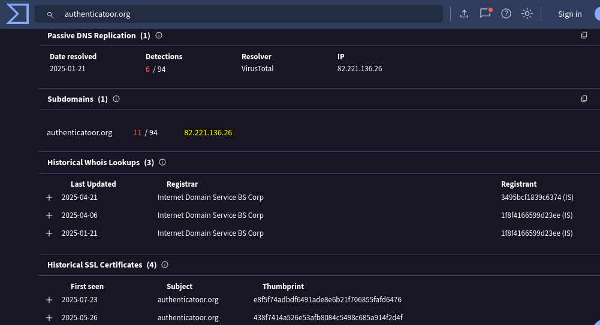
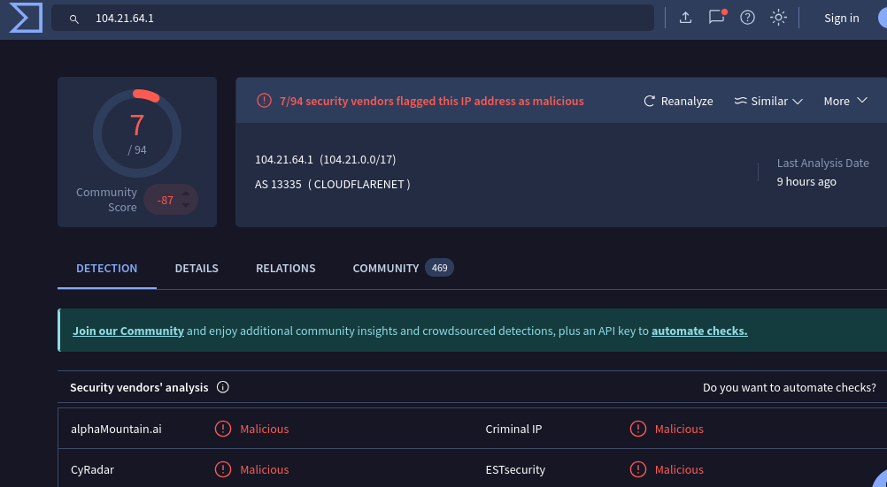
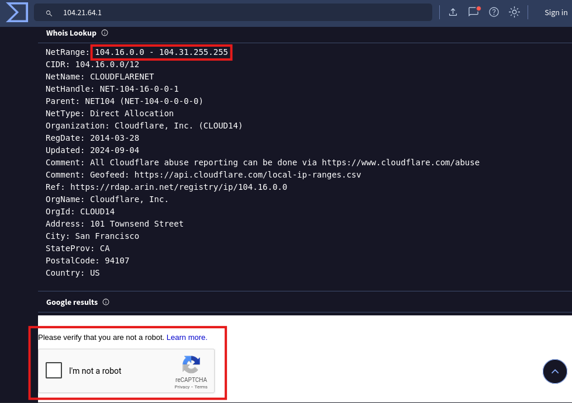
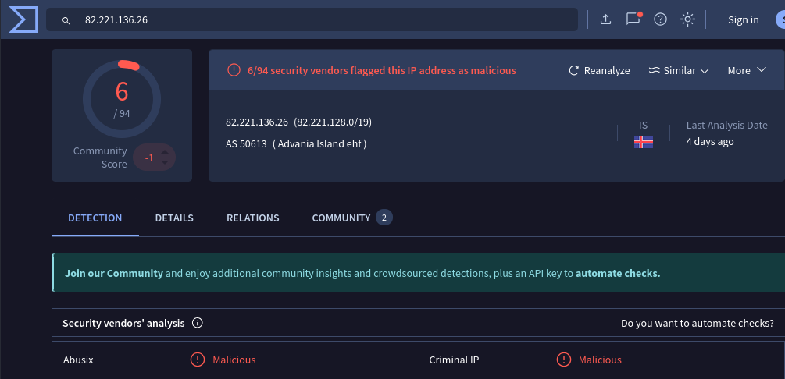
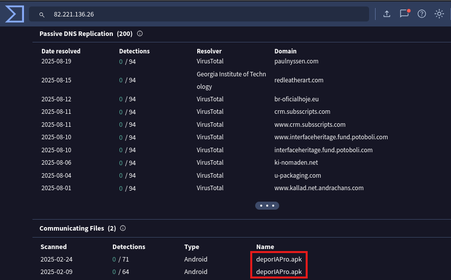

  
🔗 Liens VirusTotal

    
[google-authenticator.burleson-appliance[.]net](https://www.virustotal.com/gui/domain/google-authenticator.burleson-appliance.net)

[authenticatoor[.]org](https://www.virustotal.com/gui/domain/authenticatoor.org)

[104.21.64[.]1](https://www.virustotal.com/gui/ip-address/104.21.64.1)

[82.221.136[.]26](https://www.virustotal.com/gui/ip-address/82.221.136.26)

---

#### Q6. What are the IP addresses used for C2 servers for this infection?

    
💡 Étapes

  - Étape 1 : Appliquer un filtre pour identifier tous les adresses IP sortants de l’hôte infecté.

        ip.src == 10.1.17.215 && (http.request or tls.handshake == 1 or (tcp.flags.syn == 1 && tcp.flags.ack == 0)) && !(ssdp) && ip.dst != 10.1.17.0/24
        
  - Étape 2 : Filtrer les adresses IP internes/légitimes
    
          ⚠️ Trafic vers réseau interne (10.1.17.0/24)
          ⚠️ Services connus comme Microsoft, Google, Edge, etc.

  - Étape 3 : Vérifier la réputation des adresses IP suspects via [VirusTotal](https://www.virustotal.com/gui/home/upload).

  
✅ Réponse

  
`5.252.153[.]241`

`45.125.66[.]32`

`45.125.66[.]252`

  
📷 Captures

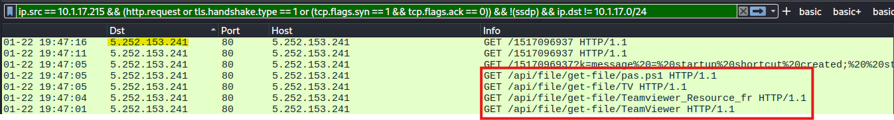
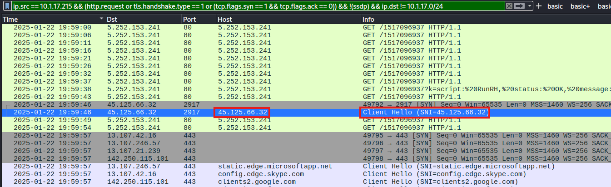
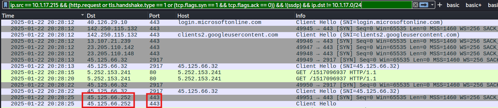

  
🔗 Liens VirusTotal

[5.252.153[.]241](https://www.virustotal.com/gui/ip-address/5.252.153.241)

[45.125.66[.]32](https://www.virustotal.com/gui/ip-address/45.125.66.32)

[45.125.66[.]252](https://www.virustotal.com/gui/ip-address/45.125.66.252)

---

### 🕵️‍♂️ RAPPORT

Résumé...

Comportements observés...

IOCs...

TTPs...

