# 🕵️‍♂️ UNIT 42 - Quiz Wireshark, Février 2023

🔍[Source](https://unit42.paloaltonetworks.com/feb-wireshark-quiz/) 

✅[Réponses officielles](https://unit42.paloaltonetworks.com/feb-wireshark-quiz-answers/)

---

## 📌 Contexte

- La capture réseau simule une infection par le malware Qakbot dans un environnement Active Directory (AD).
- Le domaine cible est `WORK4US.ORG`, avec un contrôleur de domaine (DC) identifié à l’adresse IP `10.0.0.6`.
- Tâche de fournir un rapport d'incident pour documenter l'infection.

---

## 📑 Sommaire

1. 📌 [Résumé](#resume)
2. 🖥️ [Détails de la victime](#details-de-la-victime)
3. 🚨 [Indicateurs de compromission (IoCs)](#indicateurs-de-compromission-iocs)
4. ☣️ [Détails du Malware](#details-du-malware)
5. 🛡️ [Actions correctives recommandées](#actions-correctives-recommandees)
6. 🔹 [Conclusion](#conclusion)
7. 📝 [Méthodologie](#methodologie)

---

### Données spécifiques du LAN :
- LAN : `10.0.0[.]0/24`
- Domain : `WORK4US[.]org`
- Domain Controller IP : `10.0.0[.]6`
- Domain Controller Host : `WORK4US-DC`
- LAN Gateway : `10.0.0[.]1`
- LAN Broadcast : `10.0.0[.]255`

---

## 🧰 Outils utilisés

- [Wireshark](https://www.wireshark.org/download.html)
- [Kali Linux](https://www.kali.org/)
- [VMware](https://www.vmware.com/products/desktop-hypervisor/workstation-and-fusion)
- [VirusTotal](https://www.virustotal.com/gui/home/upload)
- [MITRE ATT&CK](https://attack.mitre.org/)

---

## 🕵️‍♂️ Rapport d'incident - Infection Qakbot

  
### 📌 Résumé  

Le 2023-02-03 à 17:04 UTC, un poste Windows appartenant à `Damon Bauer` a été compromis par un malware **Qakbot** (aussi connu sous Qbot/Pinkslipbot) dans un environnement **Active Directory** (AD).

L’infection a généré du **trafic malveillant**, instauré une **backdoor** et initié des **communications** avec plusieurs serveurs C2 externes.

Des indices suggèrent une **propagation** possible vers le contrôleur de domaine (`10.0.0.6`), augmentant le risque pour l'ensemble du domaine `WORK4US.ORG`.

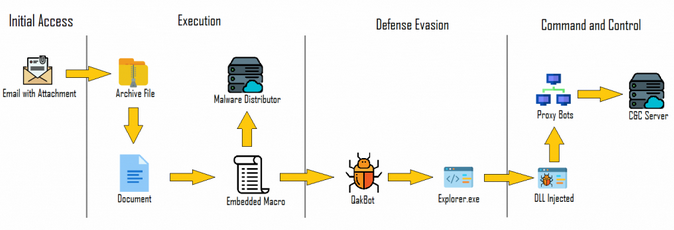

  [*Source image*](https://securelist.com/qakbot-technical-analysis/103931/)

---

### 🖥️ Détails de la victime 

- Utilisateur : `damon.bauer`
- Host : `DESKTOP-E7FHJS4`
- IP locale : `10.0.0[.]149`
- Adresse MAC : `00:21:5d:9e:42:fb`

---

### 🚨 Indicateurs de compromission (IoCs) 

| 🔹 Type | 📌 Détail | 📝 Description / Remarques |
|---------|----------|----------------------------|
| **💾 Téléchargement initial** | `hxxp://128.254.207[.]55/86607.dat` (port 80) | **DLL Qakbot** téléchargée automatiquement, point d’entrée de l’infection |
| **🌐 C2 (HTTPS)** | `102.156.32[.]143:443`, `208.187.122[.]74:443`, `5.75.205[.]43:443` | Communication chiffrée avec **serveurs C2 externes** |
| **🌐 C2 (TCP)** | `23.111.114[.]52:65400` | Flux TCP pour **exfiltration de données** et contrôle à distance |
| **🖥️ Contrôle à distance (VNC)** | `78.31.67[.]7:443` | Connexion VNC **pour prendre le contrôle de l’hôte infecté** |
| **📧 Spam / SMTP** | Diverses IP sur ports TCP 25 et 465 | Tentatives d’**envoi massif d’emails** depuis l’hôte infecté |
| **🔍 Reconnaissance réseau** | ARP scanning depuis `10.0.0[.]149` | Découverte d’autres machines sur le LAN, préparation du **mouvement latéral** |
| **📂 Mouvement latéral / SMB** | Transferts SMB vers `10.0.0[.]6` (DC) | Déploiement de DLLs malveillants sur le **contrôleur de domaine**, tentative de compromission AD |

### ☣️ Détails du Malware 
- SHA 256 : `713207d9d9875ec88d2f3a53377bf8c2d620147a4199eb183c13a7e957056432`
- Type : DLL 32-bit
- Taille : 1,761,280 bytes
- Description : DLL utilisée par Qakbot
- Méthode d'exécution : `rundll32.exe [filename],Wind`
- Sample disponible sur [MalwareBazaar](https://bazaar.abuse.ch/sample/713207d9d9875ec88d2f3a53377bf8c2d620147a4199eb183c13a7e957056432/)
- Community Score de 55 / 72 sur [VirusTotal](https://www.virustotal.com/gui/file/713207d9d9875ec88d2f3a53377bf8c2d620147a4199eb183c13a7e957056432/details)

## 🕵️ MITRE ATT&CK Mapping :   
Pour une analyse détaillée des TTPs associées à Qakbot :
[MITRE ATT&CK](https://mitre-attack.github.io/attack-navigator//#layerURL=https%3A%2F%2Fattack.mitre.org%2Fsoftware%2FS0650%2FS0650-enterprise-layer.json)

### 🛡️ Actions correctives recommandées 
1️⃣ Containment (Confinement)  
- Isoler immédiatement le poste infecté (`10.0.0[.]149`) du réseau.  
- Bloquer les communications sortantes vers les IP C2 identifiées (voir [IoCs](#-indicateurs de compromission-iocs)):
  
`128.254.207[.]55`, `102.156.32[.]143`, `208.187.122[.]74`, `5.75.205[.]43`, `23.111.114[.]52`, `78.31.67[.]7`  
- Restreindre les privilèges de l’utilisateur compromis (`damon.bauer`) jusqu’à investigation complète.  

2️⃣ Eradication  
- Supprimer toutes les DLLs malveillantes et fichiers `.cfg` transférés via SMB/SMB2.  
- Réinitialiser les mots de passe AD de l’utilisateur compromis et des comptes administrateurs éventuellement affectés.  
- Scanner tous les postes du LAN (`10.0.0[.]0/24`) avec un antivirus/EDR mis à jour pour détecter Qakbot.  

3️⃣ Recovery (Récupération)  
- Restaurer les fichiers critiques du DC depuis des sauvegardes fiables si nécessaire.  
- Vérifier l’intégrité des services AD et de la réplication des contrôleurs de domaine.  

4️⃣ Prévention / Durcissement  
- Mettre à jour tous les OS/logiciels.
- Déployer une solution EDR capable de détecter et bloquer les comportements Qakbot.
- Former les utilisateurs sur les attaques par phishing, principale porte d’entrée de Qakbot.
- Restreindre les connexions SMB externes et activer le logging détaillé pour détecter tout mouvement latéral.

---

### 🔹 Conclusion 

| 🔹 Élément | 📊 Impact / Observations |
|------------|-------------------------|
| Postes compromis | 1 hôte identifié (`10.0.0[.]149`) |
| Serveurs touchés | Tentative de compromission DC (`10.0.0[.]6`) |
| Activité malveillante | Téléchargement Qakbot, C2 HTTPS/TCP, VNC, spambot, ARP scanning, SMB lateral movement |
| Risque pour le domaine | Élevé – propagation possible et contrôle AD potentiel |

- L’infection par Qakbot a démontré une capacité à se propager dans l’AD.  
- Les mesures de confinement, d’éradication et de prévention doivent être appliquées **immédiatement** pour limiter l’impact sur `WORK4US.ORG`.

---

## 📠Méthodologie  

### 💡 IP local

  
Examiner le trafic web suspect en filtrant les requêtes HTTP et les handshakes TLS :    

`(http.request or tls.handshake.type == 1) and !(ssdp)`

➡️ IP source : `10.0.0[.]149`  
➡️ Adresse MAC : `00:21:5d:9e:42:fb`

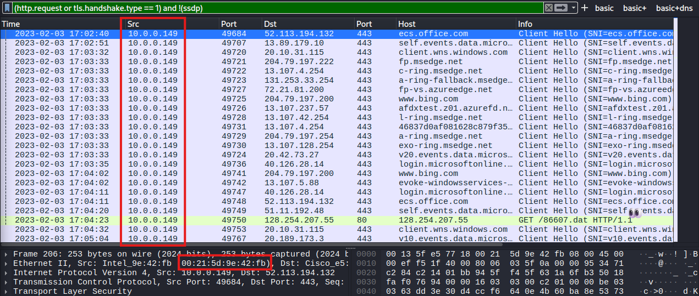

---

### 💡 Hosts

Identifier le nom NetBIOS et hôte Windows :    

`nbns or smb or smb2`

➡️ Host name : `DESKTOP-E7FHJS4`

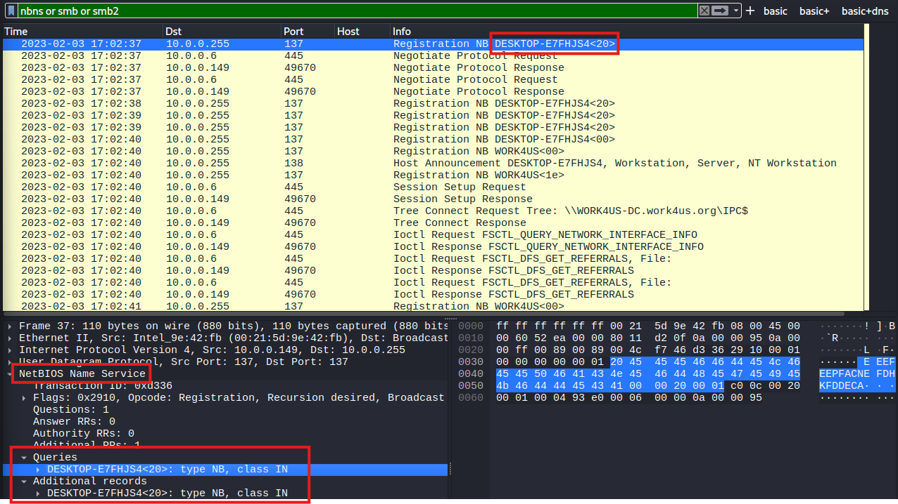

---

Examiner le trafic Kerberos pour identifier l’utilisateur :  

`kerberos.CNameString && ip.src == 10.0.0.149`  
- 📝 N.B. : Ajout de `CNameString` en colonne pour faciliter l’identification.

➡️ Utilisateur : `damon.bauer`

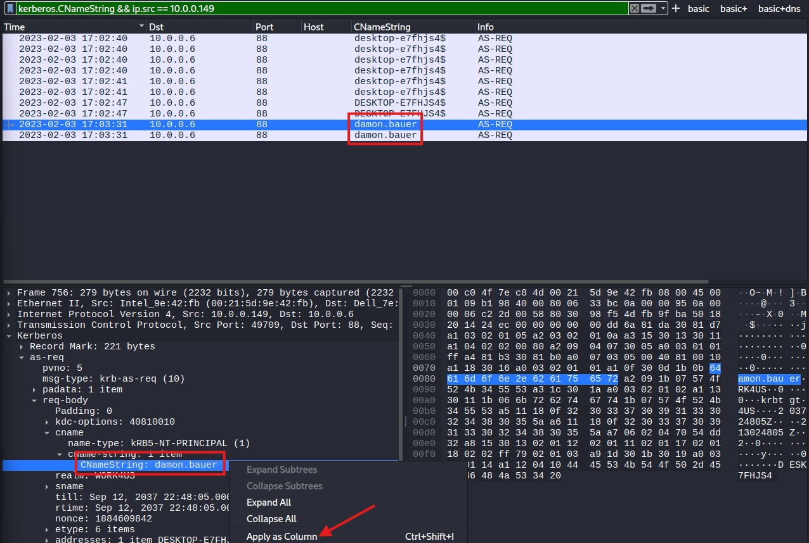

---

### 💡 Trafic HTTP

Analyser le trafic HTTP non chiffré pour identifier l'origine de l’infection :   

`http && ip.src == 10.0.0.149`

➡️ HTTP GET suspect vers une IP externe `128.254.207[.]55` → **investigation**  
➡️ HTTP GET vers `cacerts.digicert.com` → trafic légitime généré par OS/navigation normale  

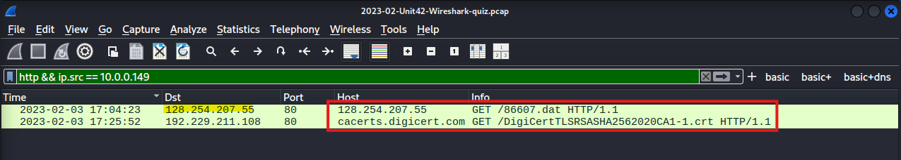

Suivre le **TCP Stream** pour la requête suspecte vers `128.254.207[.]55` pour le fichier `86607[.]dat` :    
➡️ Headers minimalistes, présence de `CURL` → téléchargement automatisé = 🚩   
➡️ Fichier exécutable (`MZ` + `This program cannot be run in DOS mod`) = 🚩    

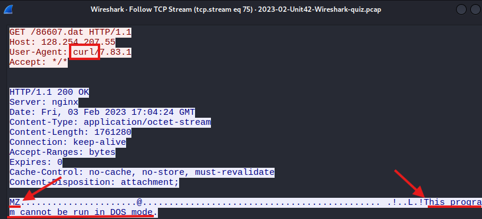

---

Exporter le fichier depuis le PCAP : `File → Export Objects → HTTP`  

Après téléchargement :     
✅ Vérification type de fichier : `file 86607.dat`  
✅ Hash SHA256 : `shasum -a 256 86607.dat`   
✅ [VirusTotal](https://www.virustotal.com/gui/file/713207d9d9875ec88d2f3a53377bf8c2d620147a4199eb183c13a7e957056432/details) : détecté par plusieurs fournisseurs  

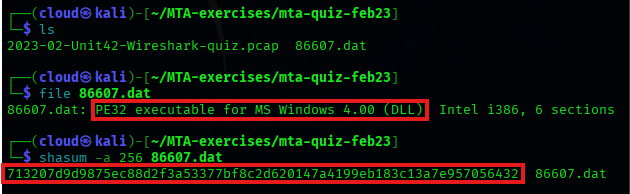  
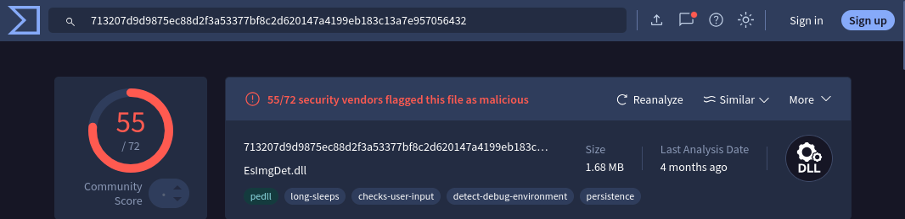

---

### 💡 Trafic Post-Infection

#### HTTPS sans SNI (Server Name Indication)
Filtrer le trafic HTTPS sans nom de domaine :    
`tls.handshake.type == 1 and tls.handshake.extension.type != 0`  
- 📝 N.B. : Les connexions directes vers une IP sont rares et souvent utilisées par des malwares (Qakbot, Trickbot, Emotet).
  
Lister les endpoints IPv4 : `Statistics → Endpoints`  

- Repérer les adresses IP externes des serveurs C2 contactées par l’hôte infecté `10.0.0[.]149`.  
➡️ `5.75.205[.]43`  
➡️ `102.156.32[.]143`  
➡️ `208.187.122[.]74`

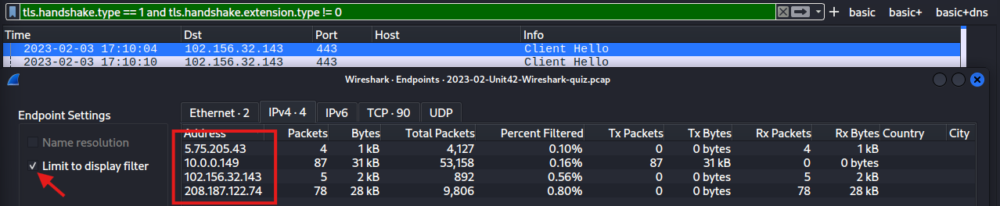

---

#### Certificats TLS
Vérifier les certificats TLS (`11`) pour chaque IP :  
`tls.handshake.type == 11 and ip.addr == <IP_C2>`
   
Examiner `rdnSequence` :  
➡️ `102.156.32[.]143` et `208.187.122[.]74` = Valeurs aléatoires, typique de Qakbot  
➡️ `5.75.205[.]43` = Domaine spoofed/inactif (`vipsauna[.]com`) → certificat auto-signé C2  

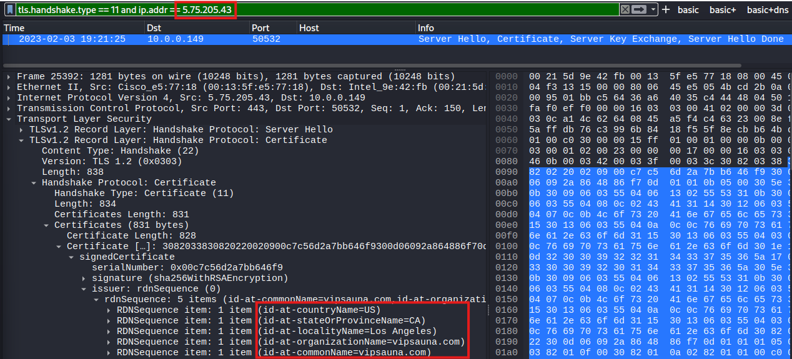
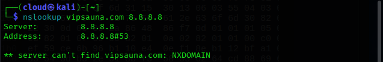

---

#### Trafic C2 (:65400) 
Trafic initié (`SYN == 2`) sur TCP Port `65400` :  
`tcp.port == 65400 && tcp.flags == 2`  

➡️ IP C2 contactée : `23.111.114[.]52`  

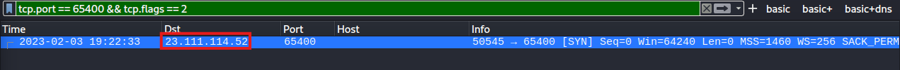

Lorsqu'on suit le TCP Stream, on trouve rapidement les informations de l'hôte infecté :  
➡️ Hôte (string) : `jzbxct683972`  
➡️ IP publique de l'hôte : `71.167.93[.]52`  
- 📝 N.B. : Ce flux est typique d'un malware qui envoie immédiatement des informations sur la victime au serveur C2 pour établir un contrôle initial.  

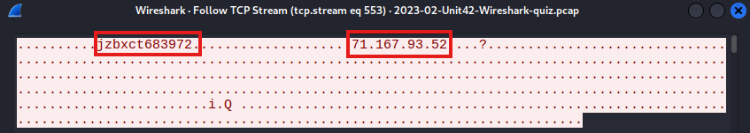

---
#### Spambot
Filtrer le trafic `SMTP` pour détecter l'activité de **Spambot** :  
`smtp && ip.src == 10.0.0.149`  

➡️ L’hôte infecté contacte plusieurs serveurs de messagerie publics, ce qui est suspect dans un environnement AD.

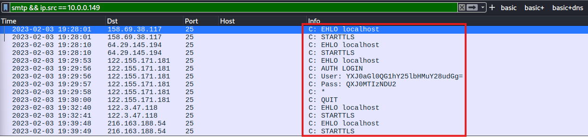

Plus spécifiquement, on peut détecter/quantifier l'activité du Spambot avec la commande `EHLO` :  
`smtp.req.command contains "EHLO" && ip.src == 10.0.0.149`  

➡️ au moins 5 tentatives de connexions en ~10 minutes = 🚩

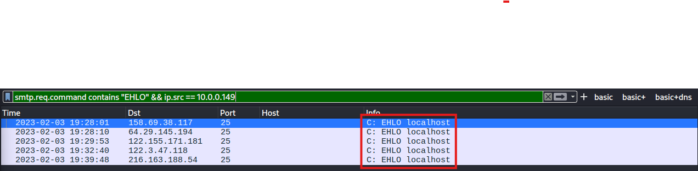

Pour voir l'ensemble du trafic (unencrypted ET encrypted) :  
`tls.handshake.type == 1 and (tcp.port == 25 or tcp.port == 465 or tcp.port == 587) && ip.src == 10.0.0.149`  

➡️ au moins 25 serveurs contactés en ~20 minutes == 🚩 
- 📝 N.B. : Aucun email spambot disponible à analyser/export (`File → Export Objects → IMF`)

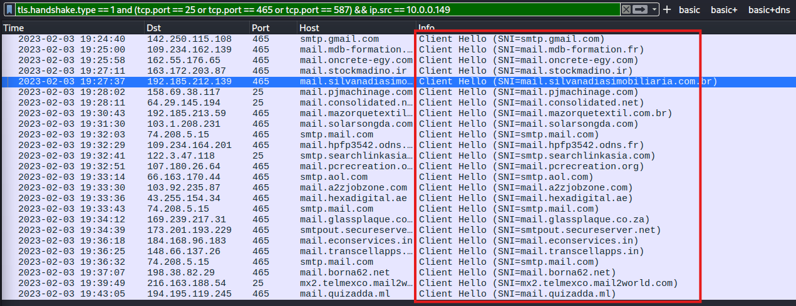

✅ L’hôte infecté tente d’envoyer des emails en masse  
✅ Confirme une activité spambot post-infection  
✅ Permet d’identifier la portée de l’infection et les serveurs ciblés  

---

#### Trafic VNC
Protocole de partage de bureau à distance, VNC permet aux acteurs malveillants de prendre le contrôle d'un hôte infecté.
- 📝 N.B. : L'adresse IP `78.31.67[.]7` sur le port TCP `443` est un serveur C2 connu associé au malware Qakbot.  

`ip.addr == 78.31.67[.]7 && tcp.flags == 2`

2 flux TCP détectés :  
➡️ Premier flux : motif répétitif de 13 octets  
➡️ Second flux : flux RFB contenant la **mention ASCII VNC**, indiquant le partage de bureau à distance   
- 📝 N.B. : Cette séquence est caractéristique d’un malware exploitant VNC pour contrôler l’hôte à distance.

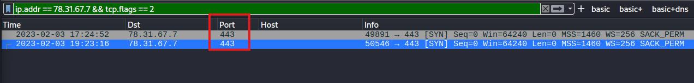
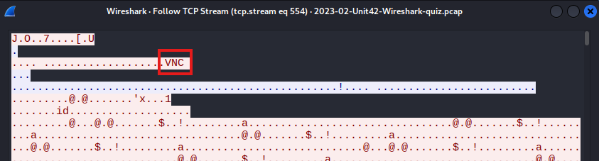

---

#### ARP Scanning
Les attaquants utilisent parfois le ARP scanning pour découvrir d’autres adresses IP actives sur un **réseau compromis**.  
Cela se fait au niveau des **adresses MAC**, en envoyant des requêtes ARP à l’adresse de broadcast `ff:ff:ff:ff:ff:ff` pour toutes les IP d’un segment réseau.  

Dans ce PCAP, l’hôte infecté (`00:21:4d:9e:42:fb`) balaie le segment de `10.0.0[.]254` à `10.0.0[.]2`.   
`arp && eth.dst == ff:ff:ff:ff:ff:ff`

Les adresses déjà connues sont exclues :  
➡️ Hôte infecté : `10.0.0[.]149`   
➡️ Contrôleur de domaine : `10.0.0[.]6`  
➡️ Passerelle réseau : `10.0.0[.]1`  
➡️ Adresse broadcast : `10.0.0[.]255`  

Si l’hôte infecté détecte une IP active, il envoie un ping `ICMP` puis tente de se connecter sur différents ports TCP/UDP.
- 📝 N.B. : Technique n’est pas spécifique à Qakbot et a été observée avec Bumblebee, IcedID, Emotet et d’autres familles de malware. 

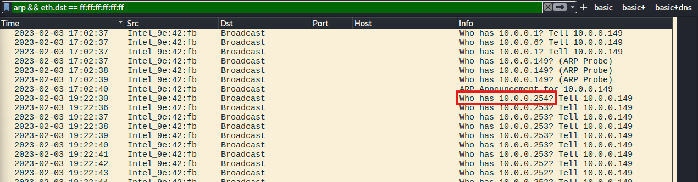
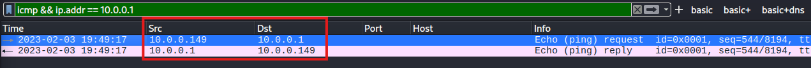

---
#### SMB
Analyse des transferts SMB pour identifier les fichiers suspects : `File → Export Objects → SMB`  
- 📝 N.B. : Fichiers `DLL` avec des **noms aléatoires** == 🚩, confirment une activité post-infection dans l'AD.  

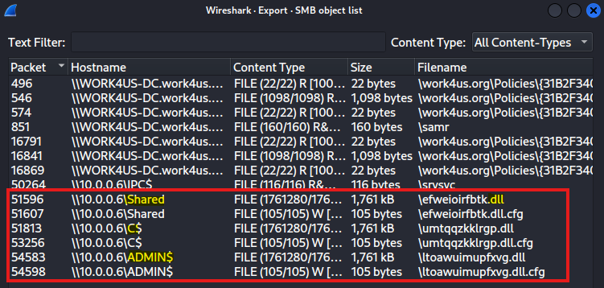

➡️ Fichiers `.dll` (1,761 KB) : DLL Windows     
➡️ Fichiers `.bin.cfg` (105 bytes) : fichiers de données binaires  
➡️ SHA256 : `713207d9d9875ec88d2f3a53377bf8c2d620147a4199eb183c13a7e957056432` = Identique au DLL initial récupéré via HTTP au début de l’infection   

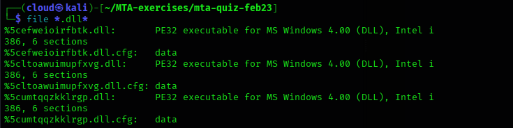
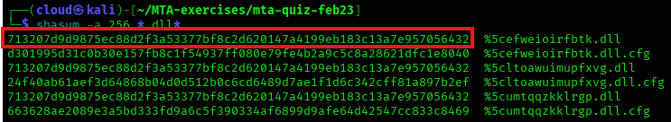

#### SMB2
Le trafic **SMB2** montre la création et le transfert de DLLs malveillants vers le DC via **NTLMSSP**. Les noms de fichiers aléatoires et l’authentification avec l’utilisateur compromis indiquent une tentative de **mouvement latéral** et d’installation de **Qakbot** dans l’AD.  
`ip.addr == 10.0.0[.]149 && ip.dst == 10.0.0[.]6 && smb2`

➡️ Le poste infecté (`10.0.0[.]149`) envoie des fichiers suspects (`.dll` et `.cfg`) au DC (`10.0.0[.]6`)  
➡️ Le malware utilise **NTLMSSP** pour s'authentifier avec le DC en usurpant l’identité de l’utilisateur compromis (`damon.bauer`)  

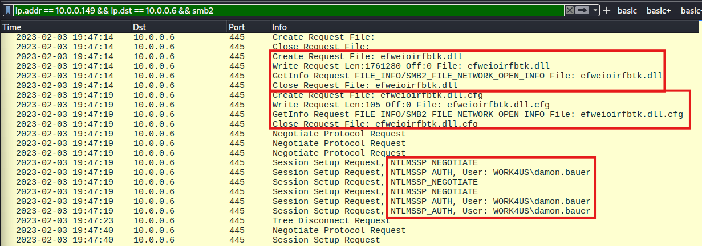

---

