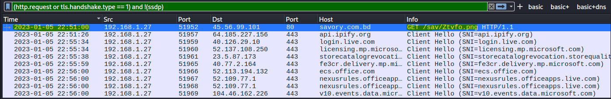
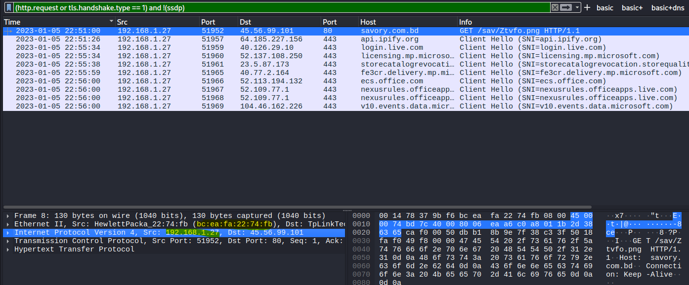
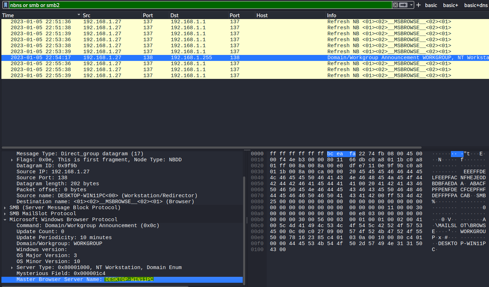
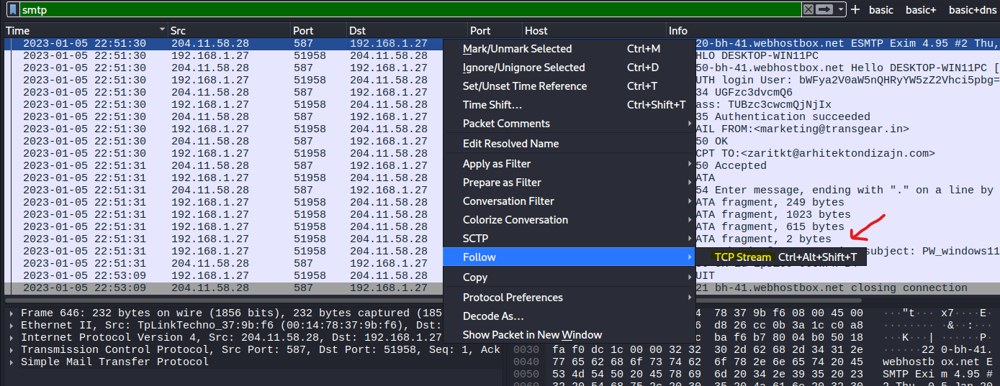
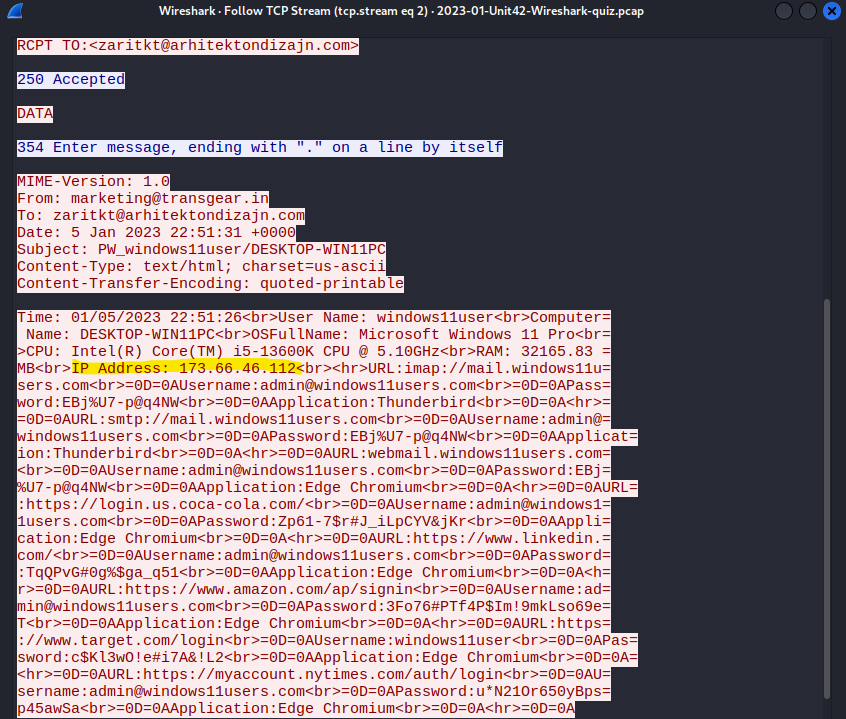

## 🕵️‍♂️ MTA-quiz-jan2023 

🔍[Source](https://unit42.paloaltonetworks.com/january-wireshark-quiz/) 

✅[Réponses officielles](https://unit42.paloaltonetworks.com/january-wireshark-quiz-answers/)

---

### 📌 Contexte

- Capture réseau simulant une infection par un malware.  
- Objectif : Extraire les informations système et réseau depuis le pcap à l’aide de Wireshark.  
- Ce document contient une **analyse pas-à-pas avec captures d’écran** pour chaque question.  

---

### 🧰 Outils utilisés

- Wireshark
- Kali Linux
- VMware

---

### 📝 Questions & Analyse

#### Q1. When did the malicious traffic start in UTC?

    
💡 Étapes

  - Étape 1 : Ouvrir le PCAP dans Wireshark

  - Étape 2 : Filtrer le fichier pour trouver la première requête HTTP suspecte

  
✅ Réponse

  
`2023-01-05 22:51 UTC`

  
📷 Captures

---

#### Q2. What is the victim’s IP address?

    
💡 Étapes

  - Étape 1 : Regarder dans le panneau *Frame Details* pour trouver l'adresse IP src

  
✅ Réponse

  
`192.168.1[.]27`

  
📷 Captures

---

#### Q3. What is the victim’s MAC address?

    
💡 Étapes

  - Étape 1 : Regarder dans le panneau *Frame Details* pour trouver l'adresse MAC src

  
✅ Réponse

  
`bc:ea:fa:22:74:fb`

  
📷 Captures
 

---

#### Q4. What is the victim’s Windows host name?

    
💡 Étapes

  
  - Étape 1 : Dans certains PCAPs, tu peux retrouver le nom d’hôte Windows de la victime grâce au trafic **NBNS ou SMB/SMB2**. Utiliser le filtre approprié.

  
✅ Réponse

  
`DESKTOP-WIN11PC`

  
📷 Captures
 

---

#### Q5. What is the victim’s Windows user account name

    
💡 Étapes

  - Étape 1 : Le protocole SMTP (port 25 par défaut) peut transmettre des emails en clair. Utiliser le filtre approprié.
  
  - Étape 2 : Inspecter le TCP Stream
    
  - Étape 3 : Relever l'information spécifique 

  
✅ Réponse

  
`windows11user`

  
📷 Captures
 

---

#### Q6. How much RAM does the victim’s host have?

    
💡 Étapes

  
  - Étape 1 : Le protocole SMTP (port 25 par défaut) peut transmettre des emails en clair. Utiliser le filtre approprié.
  
  - Étape 2 : Inspecter le TCP Stream
    
  - Étape 3 : Relever l'information spécifique 

  
✅ Réponse

  
  `32GB`

  
📷 Captures
 

---

#### Q7. What type of CPU is used by the victim’s host?

    
💡 Étapes

  
  - Étape 1 : Le protocole SMTP (port 25 par défaut) peut transmettre des emails en clair. Utiliser le filtre approprié.
  
  - Étape 2 : Inspecter le TCP Stream
    
  - Étape 3 : Relever l'information spécifique 

  
✅ Réponse

  
`Intel i5-13600K`

  
📷 Captures
 

---

#### Q8. What is the public IP address of the victim’s host?

    
💡 Étapes

  
  - Étape 1 : Le protocole SMTP (port 25 par défaut) peut transmettre des emails en clair. Utiliser le filtre approprié.
  
  - Étape 2 : Inspecter le TCP Stream
    
  - Étape 3 : Relever l'information spécifique 

  
✅ Réponse

  
`173.66.44[.]112`

  
📷 Captures
 

---

#### Q9. What type of account login data was stolen by the malware?

    
💡 Étapes

  
  - Étape 1 : Le protocole SMTP (port 25 par défaut) peut transmettre des emails en clair. Utiliser le filtre approprié.
  
  - Étape 2 : Inspecter le TCP Stream
    
  - Étape 3 : Relever l'information spécifique

  - Étape optionnelle (non présentée dans les captures) : Exporter l’email depuis le PCAP (File → Export Objects → IMF) et l’ouvrir dans un email client pour visualiser plus clairement/facilement les données.

  
✅ Réponse

  
`Usernames/Passwords en clair (unencrypted) pour différents services.`

  
📷 Captures
 

