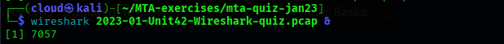

# 🕵️‍♂️ MTA-quiz-jan2023 

🔍[Source](https://unit42.paloaltonetworks.com/january-wireshark-quiz/) 

✅[Réponses](https://unit42.paloaltonetworks.com/january-wireshark-quiz-answers/)

---

### 📌 Contexte

- Capture réseau simulant une infection par un malware.  
- Objectif : Extraire les informations système et réseau depuis le pcap à l’aide de Wireshark.  
- Ce document contient une **analyse pas-à-pas avec captures d’écran** pour chaque question.  

---

### 🧰 Outils utilisés

- Wireshark
- Kali Linux
- VMware

---

### 📝 Questions & Analyse

#### Q1. When did the malicious traffic start in UTC?

- **Étape 1 :** Ouvrir le PCAP dans Wireshark
- **Étape 2 :** Filtrer le fichier pour trouver la première requête HTTP suspecte

**Capture d’écran :**  

  
✅ Réponse

  
2023-01-05 22:51 UTC

